<!-- Artwork lives in ./assets and is generated by `python3 assets/build.py`. -->

<a href="https://github.com/huytdps13400">
  
</a>

  &nbsp;
  &nbsp;
  

 

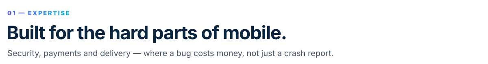
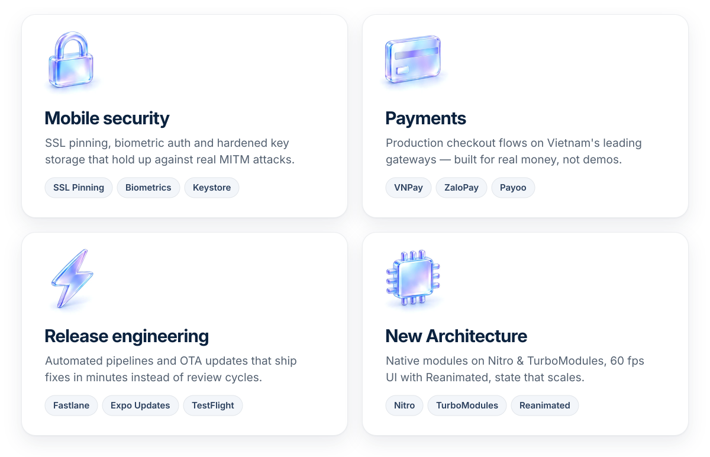

  

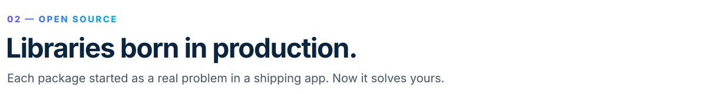

<a href="https://github.com/huytdps13400/react-native-ssl-manager">
  
</a>

  <a href="https://github.com/huytdps13400/react-native-iconify"></a>
  <a href="https://github.com/huytdps13400/react-native-sms-retriever-nitro-module"></a>
  <a href="https://github.com/huytdps13400/supabase-expo-ota-upates"></a>
  <a href="https://www.npmjs.com/~huymobile">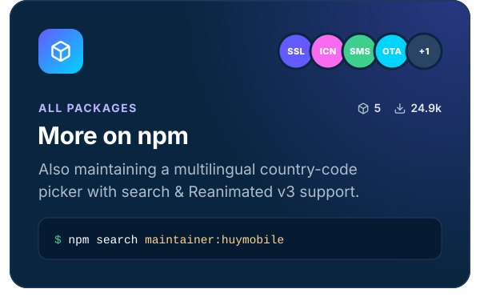</a>

  
  
  
  

<!-- CONTRIBUTIONS (uncomment once filled with merged upstream PRs):
 

| Project | Contribution | PR |
|---|---|---|
| **owner/repo** | One-line impact | [#123](https://github.com/owner/repo/pull/123) |
-->

 

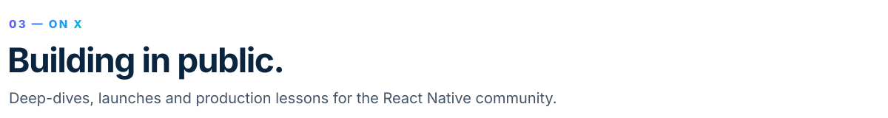

<a href="https://x.com/TrninhHuy1">
  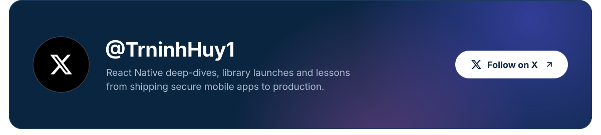
</a>

<!-- FEATURED POSTS (uncomment and fill with real numbers):
| Post | Reach |
|---|---|
| **[Post hook line](https://x.com/TrninhHuy1/status/ID)** | 👁 N views · ❤️ N likes · 🔁 N reposts |
-->

  

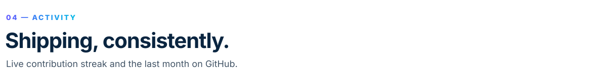


 

